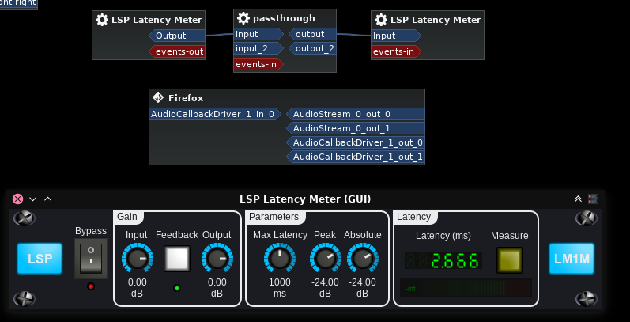
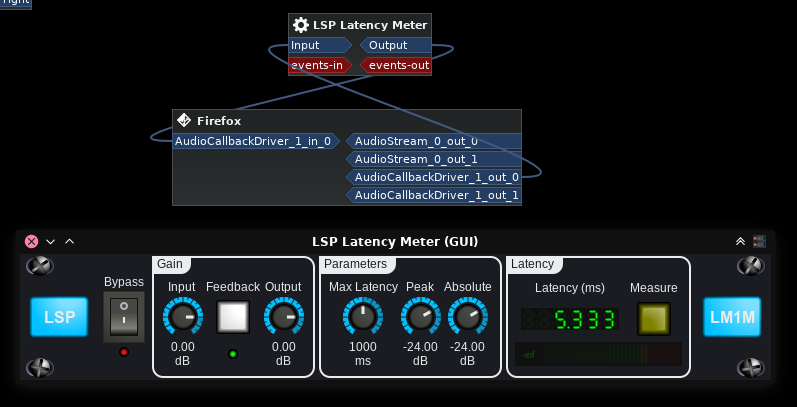
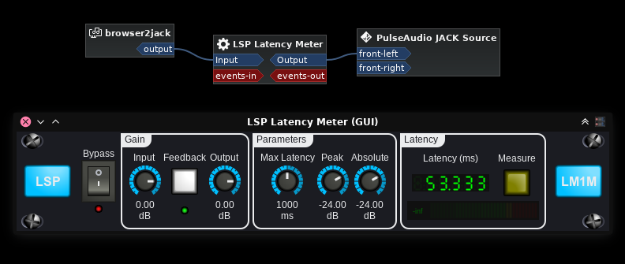

# webaudio latency tests

A project meant to test various ways to capture and playback audio through the browser, trying to get as low latency as possible.

This project currently has 2 tests:

- audio passthrough (microphone/input is connected straight to the output via browser)
- microphone/input to websocket, where the websocket feeds audio into a JACK port

From my tests, the lowest possible passthrough latency we can achieve in any browser is Firefox with JACK backend.  
Test was done with JACK running as sound server, using LSP Latency Meter audio plugin running inside Carla in JACK multi-client mode.  
This way we run a low-latency audio server and can connect Firefox inputs and outputs directly to other JACK clients.

On my setup I am running at 48kHz sample rate with 128 buffer size.  
By itself, the audio latency of the audio graph is 2.6ms, which makes sense since that is basically 128/48000*1000.

This can be easily seen by having LSP Latency Meter connecting to itself.



So we got a baseline of 2.6ms of latency for audio.  
Anything that is above this is added on the application side.

## Firefox JACK backend passthrough

Firefox with JACK backend is really the best when it comes to audio latency.  
The results speak for themselves:



So we got 5.3ms, which is 2x 2.6ms.  
Maybe Firefox has an internal buffering going on that will always make latency double of the audio graph?  
If you manage to find any browser with passthrough latency lower than this, please let me know.

NOTE: There is a Firefox bug in its JACK backend where input is not activated unless an audio stream is active.  
So for being able to test this, a video is loaded but on pause under Firefox so it keeps that stream active.

## Firefox pulseaudio backend passthrough

Now let's try running Firefox with pulseaudio (which is then bridged to JACK).  
The pulseaudio config contains these relevant lines:

```
default-sample-format = float32le
realtime-scheduling = yes
rlimit-rttime = -1
```

These are the results:



So the latency is now much higher, at 53.3ms.
