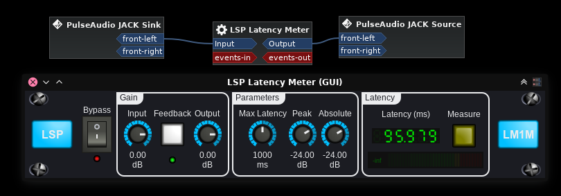
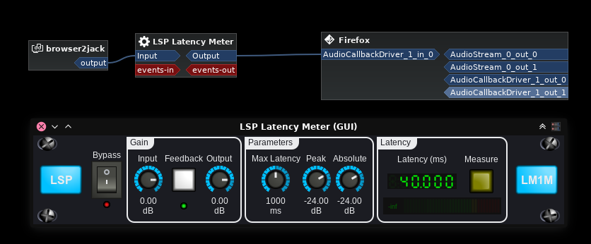

# webaudio latency tests

A project meant to test various ways to capture and playback audio through the browser, trying to get as low latency as possible.

This project currently has 2 tests:

- audio passthrough (microphone/input is connected straight to the output via browser)
- microphone/input to websocket, where the websocket feeds audio into a JACK port

From my tests, the lowest possible passthrough latency we can achieve in any browser is Firefox with JACK backend.  
Test was done with JACK running as sound server, using LSP Latency Meter audio plugin running inside Carla in JACK multi-client mode.  
This way we run a low-latency audio server and can connect Firefox inputs and outputs directly to other JACK clients.

On my setup I am running at 48kHz sample rate with 128 buffer size.  
By itself, the audio latency of the audio graph is 2.6ms, which makes sense since that is basically 128/48000*1000.

This can be easily seen by having LSP Latency Meter connecting to itself.


So we got a baseline of 2.6ms of latency for audio.  
Anything that is above this is added on the application side.

## Web Browser passthrough

This is a simple test that gets microphone/input from the browser and directly connects it to the browser outputs.  
To run this test, simply open `browser-passthrough.html` as a file URL.

### Firefox JACK backend passthrough

Firefox with JACK backend is really the best when it comes to audio latency.  
The results speak for themselves:


We got 5.3ms, which is roughly 2x 2.6ms.  
Maybe Firefox has an internal buffering going on that will always make latency double of the audio graph?  
If you manage to find any browser with passthrough latency lower than this, please let me know.

NOTE: There is a Firefox bug in its JACK backend where input is not activated unless an audio stream is active.  
So for being able to test this, a video is loaded but on pause under Firefox so it keeps that stream active.

### Firefox pulseaudio backend passthrough

Now let's try running Firefox with pulseaudio (which is then bridged to JACK).  
The pulseaudio config contains these relevant lines:

```
default-sample-format = float32le
realtime-scheduling = yes
rlimit-rttime = -1
```

These are the results:


So the latency is now much higher, at almost 50ms.

### Chrome/ium passthrough

Chrome/ium does not have a JACK backend, so we can only use pulseaudio.  
Chrome and Chromium show exactly the same latency results (within a margin of error).
<!-- It has issues running at low-latency (256 audio buffer size from browser side), ending up not always sending data on-time. -->

These are the results:



So the latency is even higher, now at almost 96ms. This is already unusable any anything realtime related.


## Web Browser microphone/input into JACK

This is a test that gets microphone/input from the browser and sends it over a websocket on the local machine.  
The websocket part is written in python but it feeds data into a native binary (compiled C code) in order to deliver audio to JACK.

To run this test, build the C code from this project (a simple `make` will suffice) and run `./browser-to-websocket.py`.  
Then you can open http://localhost:8021/ in a browser.

Worth noting that by having the websocket webserver in python, things are not exactly as fast as they could be.  
But as long we the code is able to fetch data and transmit it to the JACK/C side in the buffer size time, we are mostly okay.

### Firefox JACK backend with websocket into JACK



A whole lot of latency got introduced here.  
We went from 5.3ms to 40ms.

This is already on the limit on what is usable for realtime.  
I was able to have better results at random points, likely when the webserver is fast enough to receive data and put it in JACK buffers.  
I believe it is possible to reduce this value by using a more optimized websocket on the server side.

### Firefox pulseaudio backend with websocket into JACK


So latency is only a little bit higher compared to passthrough (~50ms passthrough, 53ms websocket+JACK)

### Chrome/ium with websocket into JACK

Chrome/ium is unable to drive a websocket fast enough for this test to work reliably.  
Oddly enough, increasing the browser-side buffer size has no effect.  
Would be worth investigating if coding the websocket webserver in C fix this.  

Needs investigation, no reliable results from this test at this point.
